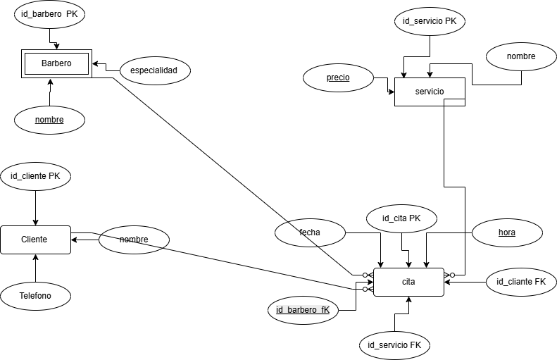

# base-datos-barber
Proyecto de base de datos para barbería usando PostgreSQL.
# Sistema de Barbería

## Descripción
Proyecto de base de datos desarrollado en PostgreSQL para la gestión de una barbería.

El sistema permite administrar:
- Clientes
- Barberos
- Servicios
- Citas

## Caso de Uso
La barbería necesita organizar las citas de los clientes, asignar barberos y registrar los servicios realizados.

Cada cliente puede tener varias citas.
Cada barbero puede atender múltiples citas.
Los servicios pueden ser utilizados en diferentes citas.

## Tecnologías Utilizadas
- PostgreSQL
- pgAdmin 4
- Draw.io
- GitHub

## Modelo Entidad Relación (MER)



## Tablas
- cliente
- barbero
- servicio
- cita

## Instrucciones de Uso

1. Crear la base de datos:
```sql
CREATE DATABASE barberia;
